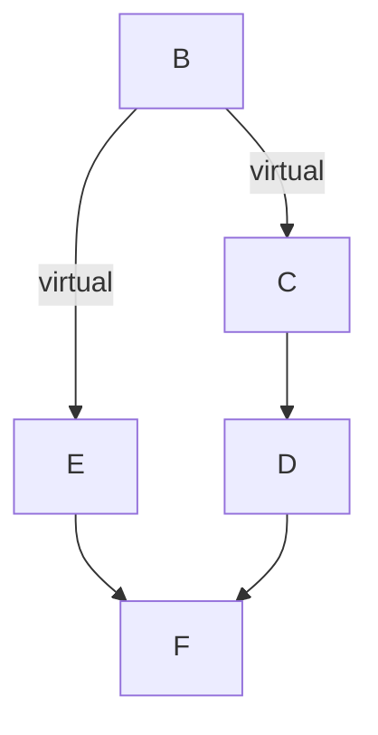

# 14. 代码重用

## 14.1 has-a关系
通常建立has-a关系是创建一个包含其他类对象的类
```c++
class Student
{
    string name;
    valarray<double> scores;
}
```
获得接口是is-a关系的组成部分，不继承接口是has-a关系的组成部分。

也可以使用私有继承将对象作为一个未被命名的继承对象添加到类中。\
使用子对象（subobject）表示通过继承或包含添加的对象。

私有继承提供的特性与包含相同：获得实现，但不获得接口\
使用包含时将使用对像名来调用方法，而私有继承使用类名和作用域解析运算符来调用方法。

继承没有对象名只能使用一个对象，包含可以有多个。\
私有继承特性比包含多，假如继承的类有保护成员，使用包含则无法访问，而私有继承作为派生类可以访问保护成员。
另一种使用私有继承的情况是需要重新定义虚函数。派生类可以重新定义虚函数，包含类不能。

使用多个基类的继承被称为多重继承（multiple inheritance, MI）

**保护继承**\
使用保护继承时，基类的公有成员和保护成员都将称为派生类的保护成员。
基类的接口在派生类中可用，在继承之外不可用。


**using重新定义访问权限**\
假设要让基类的方法在派生类外面可用，如Student类能使用valarray()类中的sum()方法
```c++
double Student::sum() const
{
    return std::valarray<double>::sum();    //这样就可以在外部使用valarray的sum()函数
}
```
或者使用using声明指出派生类可以使用的特定基类成员：
```c++
class Student : private std::string, private std::valarray<double>
{
public:
    using std::valarray<double>::min;   //using声明只使用成员名
    using std::valarray<double>::max;
    ...
};
```

## 14.2 多重继承
**虚基类**\
虚基类使得从多个类派生出的对象只能继承以一个基类对象
```c++
class Derived1 : virtual public Base{...};    //Base为Derived1虚基类
class Derived2 : public virtual Base{...};    //可以认为两者共享一个Base对象
class Derived3 : public Derived1, public Derived2{...};     //会继承一个Base对象副本，与Derived1、2分开，也就是有两个Base对象
```
- 虚基类的构造函数由最终的派生类负责调用。
- 虚基类的析构函数由最初的基类负责调用。
- 使用虚基类时，禁止信息通过中间类自动传给基类。


1. 混合使用虚基类和非虚基类\
如果基类是虚基类，派生类将包含基类的一个子对象；如果不是虚基类，派生类将包含多个子对象。
当虚基类和非虚基类混合时，如B用作C、D的虚基类，用作X、Y的非虚基类，再从C、D、X、Y派生出M，
此时类M从C、D继承一个B类子对象，从X、Y分别继承一个子对象，M包含三个B类子对象。

2. 虚基类和支配
```c++
class B
{
public:
    short q();
    ...
};

class C : virtual public B
{
public:
    long q();
    int omg();
...
};

class D : public C
{
    ...
};

class E : virtual public B
{
private:
    int omg();
    ...
};

class F : public D, public E
{
    ...
};
```



类C中的q()定义优先于B中q()定义，因为C从B派生而来。因此F中可以使用q()代替C::q()。
另一方面上，任意一个omg()都不优先于其它omg()，因为C和E都不是对方的基类，所以在F中使用omg()会有二义性。

虚二义性规则与访问规则无关，即使E::omg()是私有的，不能在F中直接访问，但使用omg()仍导致二义性。
同样，即使C::q()是私有的，也将优先于D::q()。


## 14.3 类模板
模板提供参数化类型，即能够将类型名作为参数传递给接收方来建立类或函数。
```c++
template<class Type>
template<typename Type>     //两种都行
////////////////////////////////////////////////
template<calss Type>
bool Stack<Type>::push(const Type& item){ ... }
```
模板是C++编译指令，不是类和成员函数，用来说明如何生成类和成员函数定义。
模板的具体实现被称为实例化（instantiation）或具体化（specialization）
不能将模板成员函数放在独立的实现文件中。

**模板类**\
在程序中包含模板并不能生成模板类，必须请求实例化。
```c++
Stack<int> kernels;     //编译器按Stack<Type>模板生成两种独立的类声明和类方法
Stack<string> colonels;
```
泛型标识符，如Type，被称为类型参数（type parameter）类似于变量，但赋给它们的只能是类型。
与函数模板不同，必须显示的提供所需类型，因为编译器可以根据函数的参数类型来确定生成哪中函数。


**数组模板**\
在类中可以声明指定数组大小的模板，也可在类中使用动态数组和构造函数来提供元素数目。
还可以使用模板参数提供常规数组的大小。
```c++
template<class T, int n>
class A
{
    T a[10];  //指定数组大小
    T b*;     //用构造函数来提供
    T c[n];   //用n传入指定大小
public:
    A(int s) { b = new T[s]; }
    ~A(){delete[] b;}
};
```

**模板具体化**\
类模板与函数模板很相似，模板以泛型的方式描述类，而具体化使用具体的类型生成类声明。
1. 隐式实例化
```c++
ArrayTP<int, 100> stuff;    //隐式实例化

ArrayTP<double, 30>* pt;    //不会生成类的实例化，只是个指针
pt = new ArrayTP<double, 30>;   //生成类定义，并创建对象
```

2. 显示实例化\
使用template并指出所需类型类声明类时，编译器将生成类声明的显示实例化，声明必须位于模板定义所在的名称空间中。
```c++
template class ArrayTP<string, 100>;    //创建ArrayTP<string, 100>类
```
虽然没有类对象，编译器也会生成类声明（包括方法定义）。

3. 显示具体化\
是特定类型（用于替换模板中的泛型）的定义，对特定的类型，定义特定的方法。
```c++
//假设有个模板
template<typename T>
class SortedArray
{
    ...
}
//该模板传入char*类型时，则使用下面的定义
template<> class SortedArray<const char char *>
{
    ...
}

//具体化模板定义格式
template<> class Classname<specialized-typ-name> { ... }
```

4. 部分具体化\
c++可以使用部分具体化限制模板的通用性，可以给类型参数之一指定具体类型：
```c++
//生成模板
template<class T1, class T2> class Pair{...};
//将T2设为int
template<class T1>
class Pair<T1, int>{...};

template<> class Pair<int, int>{...};   //<>内为空将导致具体化：
```


**成员模板**
```c++
template<typename T>
class beta
{
private:
    template<typename V>
    class hold
    {
    private:
        V val;
    public:
        hold(V v=0) : val(0) { }
        void show() const {cout << val << endll}
        V Value()const{return val;}
    };
    hold<T> q;
    hold<int> n;
public:
    beta(T t, int i) : q(t), n(i) { }
    template<typename U>
    U blad(U u, T t) {return (n.Value() + q.Value()) * u/t;}
    void Show()const {q.show(); n,show();}
}
```
也可以在beta中声明hold类和blah方法，在外面定义。


**将模板用作参数**
```c++
template<template<typename T> class Thing> class Crab{...}
template<typename T> class King{...}
//假设Crab中成员有
{
private:
    Thing<int> a1;
    Thing<float> a2;
}

int main()
{
    Crab<King> legs;    //King必须是一个模板类
    Crab<Stack> SS;     //会生成Stack<int>、Stack<float>
}
```

**模板和友元**
模板友元分为3类：
- 非模板友元；
- 约束（bound）模板友元，即友元的类型取决于类被实例化时的类型；
- 非约束（unbound），模板友元，即友元所有具体化都是类的每一个具体化的友元。

1. 模板类的非模板友元函数
```c++
template<class T>
class HasFriend
{
public:
    friend void counts();   //consts成为模板所有实例化的友元。即是HasFriend<int>友元，也是HasFriend<float>友元
    //counts可以访问全局对象；可以使用全局指针访问非全局对象；可以创建自己的对象；可以访问独立于对象的模板类的静态数据成员

    friend void report(HasFriend &);    //不能这么用
    friend void report(HasFriend<T> &); //要提供模板参数
    //带HasFriend<int>参数的report将成为HasFriend<int>的友元，带HasFriend<double>参数的report是一个重载版本，是HasFriend<double>的友元。

}
```

2. 模板类的约束模板友元函数
```c++
//首先声明每个模板函数
template<typename T> void counts();
template<typename T> void report(T &); 
//再将模板声明为友元
template<typename TT>
class HasFriendT
{
    //<>指出这是模板具体化，对于report，<>为空是因为可以从函数参数推断出模板类型参数是HasFriendT<TT>
    friend void counts<TT>();
    friend void report<>(HasFriendT<TT> &); //与report<HasFriend<TT>>(HasFriendT<TT> &)等价
}
//为友元提供模板定义
...
...
```

3. 模板类的非约束模板友元函数
```c++
template<typename T>
class ManyFriend
{
    template<typename C, typename D> friend void show(C &, D&);
}
```
每个函数具体化都是每个类具体化的友元。
对于非约束友元，友元模板类型参数与模板类类型参数是不同的。


**模板别名(C++11)**
可使用typedef为模板具体化指定别名，也可以使用模板提供一系列别名。
```c++
//使用typedef
typedef std::array<double, 12> arrd;
arrd gallons;
//使用using，用于模板
template<typename T>
using arrtype = std::array<T, 12>;
arrtype<double> gallons;
//用于非模板
typedef const char * pc1;
using pc2 = const char *;   //两者等价
```


